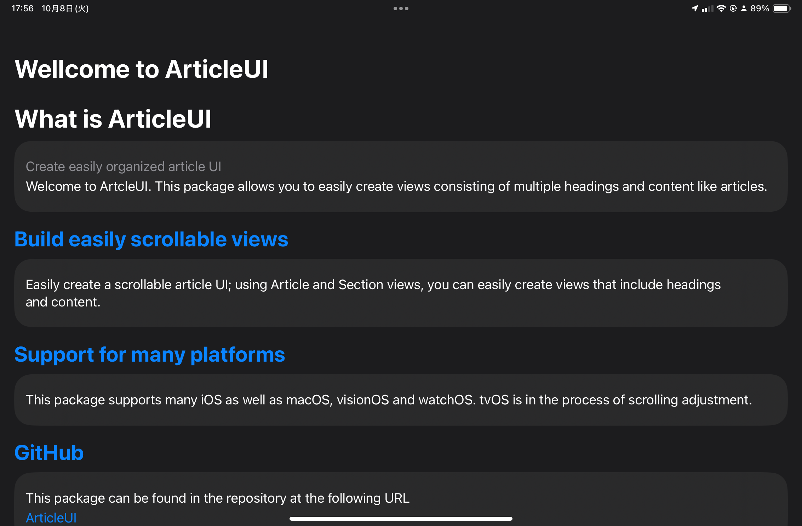
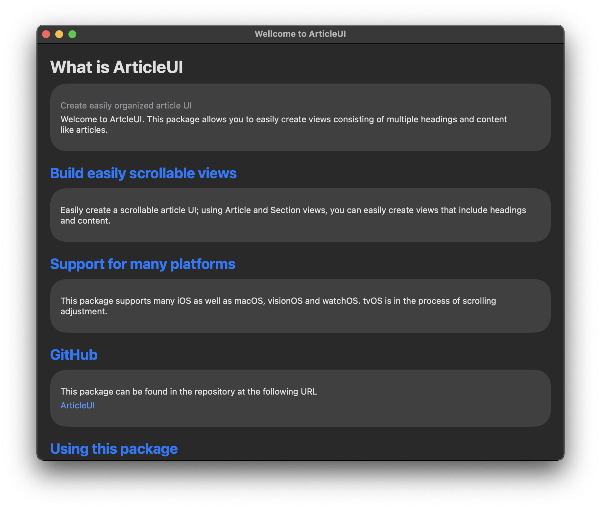

# ArticleUI

ArticleUI is a framework that allows you to display headings and content with simple code.

## Description

With this library, you can display headings and content with simple SwiftUI code.
Depending on the platform, the design can be tailored to look beautiful.

## Requirement

The following environment is required to use this library.  

<p align="center">
    
    
    
    
    
    
    <a href="https://twitter.com/IroIro1234work">
        
    </a>
</p>

## Demo

To verify the operation of this library, we created a sample application in the library. Please refer to it.

## Usage

This framework can be easily implemented by simply adding Scenes. 


```swift
import SwiftUI
import ArticleUI

struct ContentView: View {
    var body: some View {
        NavigationStack {
            Article {
                Section {
                    Text("Create easily organized article UI")
                        .foregroundStyle(.gray)
                    Text(
                        "Welcome to ArtcleUI. This package allows you to easily create views consisting of multiple headings and content like articles."
                    )
                } header: {
                    Text("What is ArticleUI")
                        .bold()
                        .font(.largeTitle)
                        .foregroundStyle(Color.primary)
                }
                .articleSectionType(style: .title)
                
                Section {
                    Text(
                        "Easily create a scrollable article UI; using Article and Section views, you can easily create views that include headings and content."
                    )
                } header: {
                    Text("Build easily scrollable views")
                }
                
                Section {
                    Text(
                        "This package supports many iOS as well as macOS, visionOS and watchOS. tvOS is in the process of scrolling adjustment."
                    )
                } header: {
                    Text("Support for many platforms")
                }
                
                Section {
                    Text(
                        "This package can be found in the repository at the following URL"
                    )
                    
                    Link(
                        "ArticleUI",
                        destination: URL(
                            string: "https://github.com/KC-2001MS/ArticleUI"
                        )!
                    )
                } header: {
                    Text("GitHub")
                }
                
#if !os(tvOS) && !os(watchOS)
                Section {
                    AppDescriptionContent(
                        iconName: "Japan Corp Info",
                        name: "Japan Corp Info",
                        id: "id6477782786"
                    ) {
                        Text(
                            """
The Japan Corp Info App is the best way to easily manage your Japan corporation information.
The app allows you to easily search gBizINFO data provided by METI, a ministry of the Japanese government.
The searched data can be saved in the device and can be viewed offline. You can also add memos and tags to each company, which can be used for corporate analysis.
"""
                        )
                    }
                } header: {
                    Text("Using this package")
                }
                .articleRowSeparatorVisibility(true)
#endif
                
                Section {
                    HStack(alignment: .top) {
                        LabeledContent {
                            VStack(alignment: .trailing) {
                                Link(
                                    "GitHub",
                                    destination: URL(
                                        string: "https://github.com/KC-2001MS"
                                    )!
                                )
                                Link(
                                    "Mail",
                                    destination: URL(
                                        string: "mailto:iroiro.work1234@gmail.com"
                                    )!
                                )
                                Link(
                                    "X",
                                    destination: URL(
                                        string: "https://twitter.com/IroIro1234work"
                                    )!
                                )
                                Link(
                                    "Mastodon",
                                    destination: URL(
                                        string: "https://mastodon.social/@Iroiro"
                                    )!
                                )
                                Link(
                                    "Bluesky",
                                    destination: URL(
                                        string: "https://bsky.app/profile/bluesky.iroiro.me"
                                    )!
                                )
                            }
                            .frame(maxWidth: .infinity, alignment: .trailing)
                        } label: {
                            Text("Keisuke Chinone")
                                .bold()
                                .font(.headline)
                        }
                    }
                    .frame(maxWidth: .infinity)
                } header: {
                    Text("Author")
                } footer: {
                    Text(
                        "Information about the author who manages this repository."
                    )
                }
            }
            .articleStyle(.grouped)
            .navigationTitle("Wellcome to ArticleUI")
        }
    }
}
```

 

 

## Swift-DocC

Swift-DocC is currently being implemented.

[Documentation](https://kc-2001ms.github.io/ArticleUI/documentation/articleui)

## Install

Xcode is required to use this library.
However, it is currently under development and cannot be installed. We will let you know as soon as possible.  

## Contribution
See [CONTRIBUTING.md](https://github.com/KC-2001MS/ArticleUI/blob/main/CONTRIBUTING.md) if you want to make a contribution.

## Licence

[ArticleUI](https://github.com/KC-2001MS/ArticleUI/blob/main/LICENSE)

## Supporting

If you would like to make a donation to this project, please click here. The money you give will be used to improve my programming skills and maintain the application.   
<a href="https://www.buymeacoffee.com/iroiro" target="_blank">
    
</a>  
[Pay by PayPal](https://paypal.me/iroiroWork?country.x=JP&locale.x=ja_JP)

## Author

[Keisuke Chinone](https://github.com/KC-2001MS)
